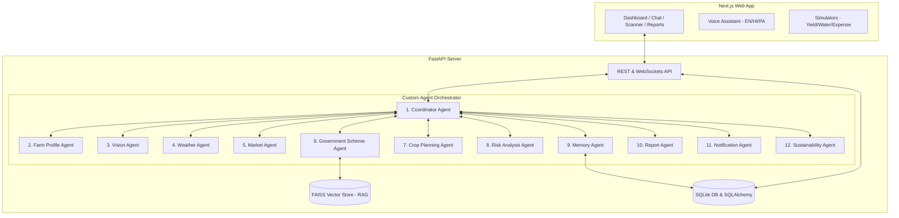

# AgriGuardian Swarm - Autonomous AI OS for Farmers

AgriGuardian Swarm is a complete, production-ready Multi-Agent AI Operating System for Farmers. It coordinates 12 specialized, collaborating AI agents to monitor farm conditions, analyze crop health, manage tasks, predict risks, and offer market and government scheme recommendations. 

Instead of waiting for individual prompts, the agents communicate, plan, and verify actions autonomously behind a unified, glassmorphic dashboard and voice-assisted interface.

---

## System Architecture



---

## The 12 Autonomous Agents

1. **Coordinator Agent (Swarm Orchestrator)**: Brain of the system. Receives requests, decides which agents should run, and combines outputs.
2. **Farm Profile Agent (Farm Registry Officer)**: Maintains farm details, soil, irrigation, land records, and farmer preferences.
3. **Vision Agent (Crop Disease & Pest Diagnostician)**: Uses Gemini Vision to detect diseases, pests, nutrient deficiencies, and severity.
4. **Weather Intelligence Agent (Agrometeorological Specialist)**: Analyzes weather, rain, heatwaves, and frost risks, giving irrigation advice.
5. **Market Intelligence Agent (Agri-Market Economist)**: Collects Mandi prices, predicts selling opportunities, and estimates profit.
6. **Government Scheme Agent (Agricultural Policy Consultant)**: Uses FAISS RAG to match loans, subsidies, and eligibility.
7. **Crop Planning Agent (Agronomist Planner)**: Creates daily/weekly tasks, fertilizer schedules, and crop rotation advice.
8. **Risk Analysis Agent (Agricultural Risk Actuary)**: Predicts disease outbreaks, water shortages, crop failures, and yield reductions.
9. **Memory Agent (Context & Memory Custodian)**: Stores and retrieves long-term farm history and chat preferences.
10. **Report Agent (Farm Analytics Compiler)**: Compiles summaries and generates downloadable PDF reports.
11. **Notification Agent (Proactive Alert Dispatcher)**: Dispatches weather alerts, medicine/fertilizer reminders, and price alerts.
12. **Sustainability Agent (Eco-Agronomy Specialist)**: Calculates water usage, carbon footprint, and eco-efficiency scores.

---

## Installation Guide

### Option 1: Docker Compose (Recommended)

1. Clone or navigate to the project directory.
2. Run the services:
   ```bash
   docker-compose up --build
   ```
3. Open your browser and navigate to:
   - Frontend: `http://localhost:3000`
   - Backend API Docs (Swagger): `http://localhost:8000/docs`

### Option 2: Local Manual Setup

#### Backend Setup
1. Navigate to the backend directory:
   ```bash
   cd backend
   ```
2. Create a virtual environment and install dependencies:
   ```bash
   python -m venv venv
   source venv/bin/activate  # On Windows: venv\Scripts\activate
   pip install -r requirements.txt
   ```
3. Start the FastAPI server:
   ```bash
   uvicorn app.main:app --reload --port 8000
   ```

#### Frontend Setup
1. Navigate to the frontend directory:
   ```bash
   cd ../frontend
   ```
2. Install dependencies and start the development server:
   ```bash
   npm install
   npm run dev
   ```
3. Open `http://localhost:3000` in your browser.

---

## How to Test the Autonomous Cascade

1. Navigate to the **Image Scanner** page.
2. Select a crop leaf image to upload.
3. Choose a mock disease (e.g., "Tomato Early Blight") from the dropdown.
4. Click **Scan with AI Swarm**.
5. Observe the **Swarm Orchestration Stream** in real-time. You will see the Coordinator Agent trigger the Vision Agent, which passes results to the Weather, Risk, Planning, Government, and Market agents to build a unified action plan.
