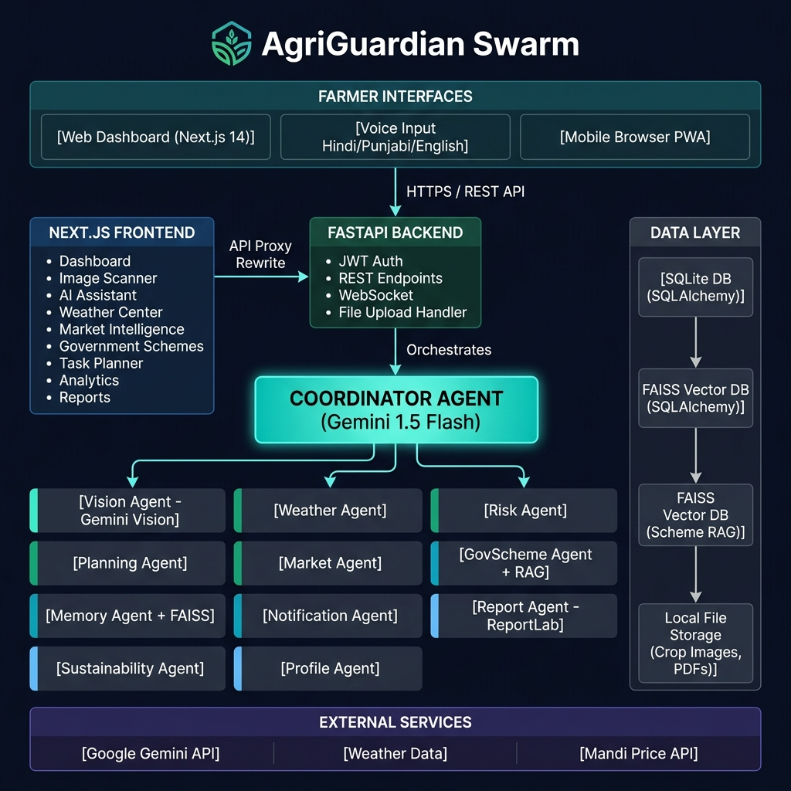
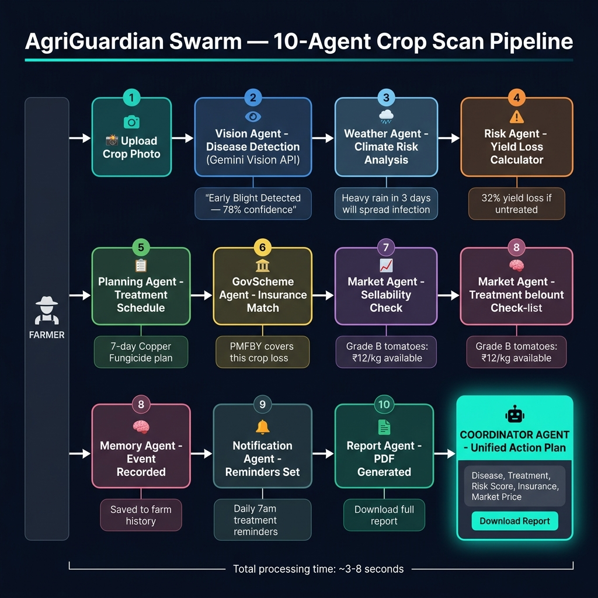

# 🌾 AgriGuardian Swarm — Autonomous AI OS for Farmers

> An autonomous multi-agent system that continuously monitors, diagnoses, and protects smallholder farms — so farmers spend less time worrying and more time growing.

[](LICENSE)
[](https://nextjs.org/)
[](https://fastapi.tiangolo.com/)
[](https://ai.google.dev/)
[](https://kaggle.com)

---

## 🏗️ System Architecture



---

## 🔄 10-Agent Crop Scan Pipeline



---

## 🤖 The 12 Agents

| Agent | Role |
|-------|------|
| **Coordinator** | Orchestrates all agents and delivers one unified action plan |
| **Vision Agent** | Analyzes crop photos via Gemini Vision to detect disease and pests |
| **Weather Agent** | Generates irrigation advice and frost/heatwave alerts |
| **Risk Agent** | Calculates compound risk scores for crop failure and yield loss |
| **Planning Agent** | Creates daily, weekly, and seasonal farm task schedules |
| **Market Agent** | Monitors mandi prices and computes net profit margins |
| **GovScheme Agent** | Semantic RAG search to match farms with government subsidies |
| **Memory Agent** | Maintains a FAISS vector database of every farm event |
| **Notification Agent** | Schedules treatment reminders and market alerts |
| **Report Agent** | Generates downloadable PDF farm reports |
| **Sustainability Agent** | Tracks carbon footprint and water efficiency |
| **Profile Agent** | Manages farm onboarding and context for all agents |

---

## 🚀 Quick Start (One Click)

```bash
git clone https://github.com/YOUR_USERNAME/agriguardian-swarm
cd agriguardian-swarm
```

**Windows:** Double-click `START.bat`

The script automatically installs all dependencies, seeds demo data, starts both servers, and opens your browser.

**Demo Login:** `farmer@agriguardian.com` / `farmer123`

---

## 🛠️ Tech Stack

| Layer | Technology |
|-------|-----------|
| **AI Engine** | Google Gemini 1.5 Flash + Gemini Vision |
| **Backend** | FastAPI, SQLAlchemy, FAISS, ReportLab, bcrypt JWT |
| **Frontend** | Next.js 14, TypeScript, Framer Motion, Recharts |
| **Database** | SQLite (upgradeable to PostgreSQL) |
| **Deployment** | Vercel (frontend) + Render (backend) |

---

## 🌱 Social Impact — UN SDGs

| SDG | How |
|-----|-----|
| SDG 1 — No Poverty | Prevents crop losses that push farmers into debt |
| SDG 2 — Zero Hunger | Improves yield for food-producing communities |
| SDG 8 — Decent Work | Increases farm profitability and market access |
| SDG 10 — Reduced Inequalities | Expert-level intelligence for every smallholder |
| SDG 13 — Climate Action | Tracks and reduces carbon footprint per farm |

---

## 📄 License

MIT License — Built for the **Google × Kaggle AI Agents Capstone — Agents for Good** track.
